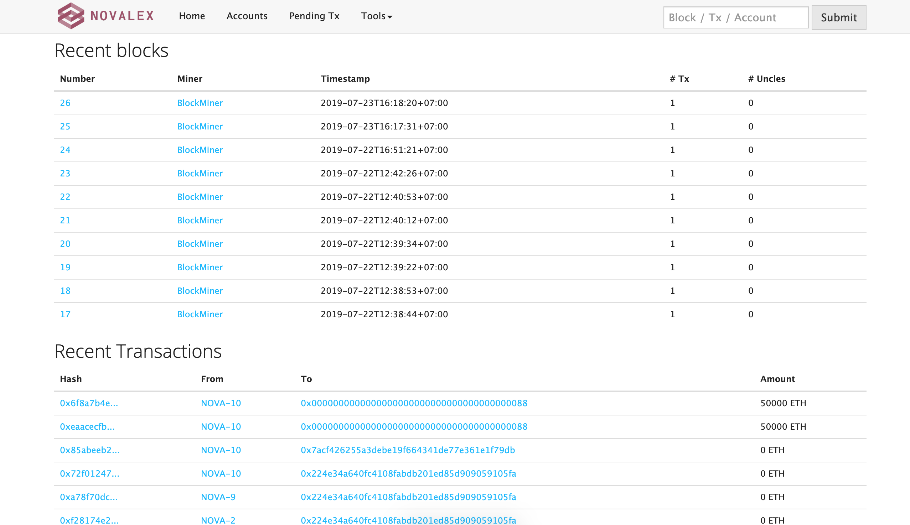

# Novalex Scan

### Lightweight blockchain explorer for your private Ethereum chain

Novalex Scan is an Ethereum blockchain explorer built with NodeJS, Express and Parity. It does not require an external database and retrieves all information on the fly from a backend Ethereum node.

While there are several excellent Ethereum blockchain explorers available (etherscan, ether.camp and novalex) they operate on a fixed subset of Ethereum networks, usually the mainnet and testnet. Currently there are no network agnostic blockchain explorers available. If you want to develop Dapps on a private testnet or would like to launch a private / consortium network, Novalex Scan will allow you to quickly explore such chains.

A demo instance connected to the Kovan Ethereum testnet is available at [scan.novalex.org](http://scan.novalex.org).


## Current Features

- Browse blocks, transactions, accounts and contracts
- View pending transactions
- Display contract internal calls (call, create, suicide)
- Upload & verify contract sources
- Show Solidity function calls & parameters (for contracts with available source code)
- Display the current state of verified contracts
- Named accounts
- Advanced transaction tracing (VM Traces & State Diff)
- View failed transactions
- Live Backend Node status display
- Submit signed Transactions to the Network
- Support for all [Bootswatch](https://bootswatch.com/) skins
- Accounts enumeration
- Signature verification
- Supports IPC and HTTP backend connections
- Responsive layout

## Planned features

- ERC20 Token support

Missing a feature? Please request it by creating a new [Issue](https://github.com/gobitfly/novalex-scan/issues).

## Usage notes

This blockchain explorer is intended for private Ethereum chains. As it does not have a dedicated database all data will be retrived on demand from a backend Parity node. Some of those calls are ressource intensive (e.g. retrieval of the full tx list of an account) and do not scale well for acounts with a huge number of transactions. We currently develop the explorer using the Kovan testnet but it will work with every Parity compatible Ethereum network configuration. The explorer is still under heavy development, if you find any problems please create an issue or prepare a pull request.

## Getting started

### Setup from source

Supported OS: Ubuntu 16.04

Supported Ethereum backend nodes: Parity (Geth is currently not supported as it does not allow account and received/sent tx enumeration)

Install Parity: `bash <(curl https://get.parity.io -L) -r stable`

1. Setup a nodejs & npm environment
2. Install the latest version of the Parity Ethereum client
3. Start parity using the following options: `parity --chain=<yourchain> --tracing=on --fat-db=on --pruning=archive`
4. Clone this repository to your local machine: `git clone https://github.com/gobitfly/novalex-scan --recursive` (Make sure to include `--recursive` in order to fetch the solc-bin git submodule)
5. Install all dependencies: `npm install`
6. Rename `config.js.example` into `config.js` and adjust the file to your local environment
7. Start the explorer: `npm start`
8. Browse to `http://localhost:3000`

### Setup using docker

Build then run the container

```bash
docker build -t novalex-scan .
docker run -p 3000:3000 novalex-scan
```

Or directly bind the config.js file to avoid rebuilding the image

```bash
docker run -p "3000:3000" \
    -v "$(pwd)/config.js":/usr/src/app/config.js \
    novalex-scan
```

### Setup using docker-compose

```bash
docker-compose up
```
